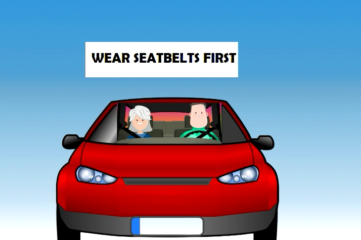
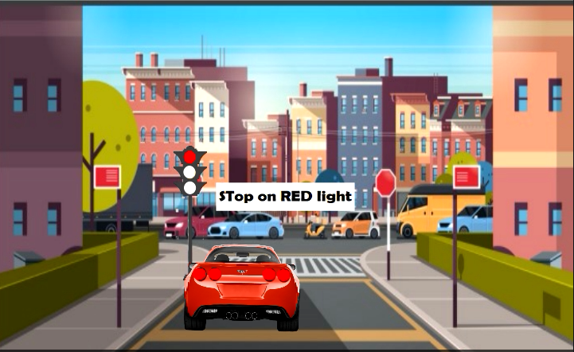
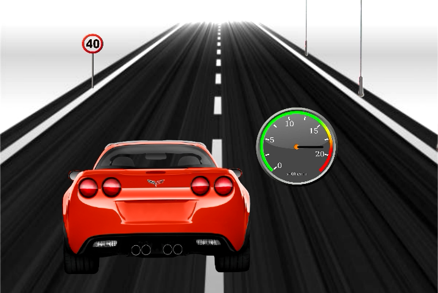
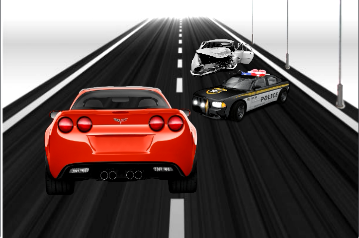
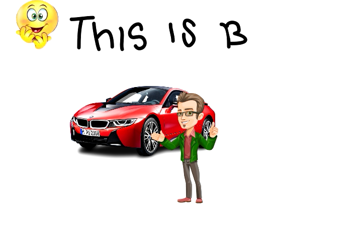

# traffic_Awareness_Anim

This is a small Project done in OpenSourse 2D animation software Tupitube (https://sourceforge.net/projects/tupi2d)
Project is mainly for childrern on traffic awareness. Covered some interesting facts on animation creation using readly avaible assets and materials. The idea is solely owner centered.
This can be used as reference for small children and Beginners to 2D animation using Tupitube or similiar softwares

